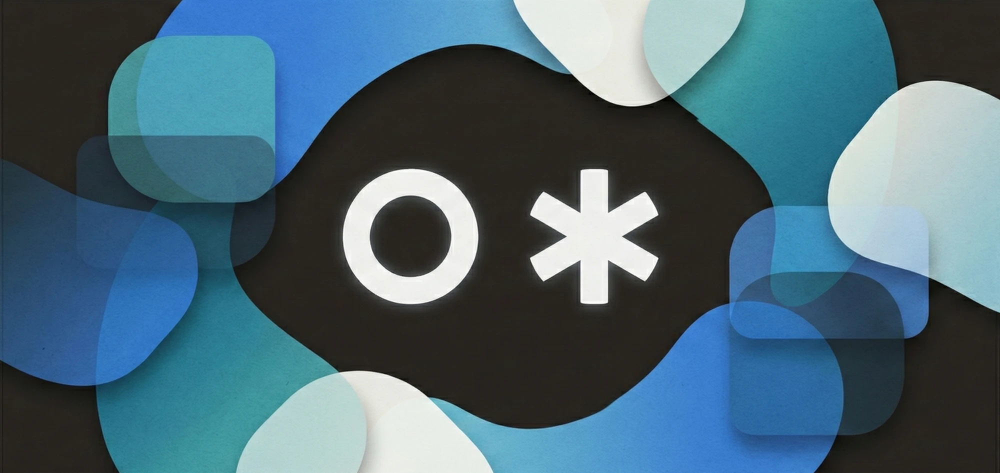
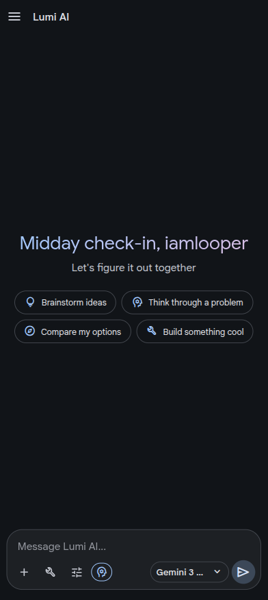
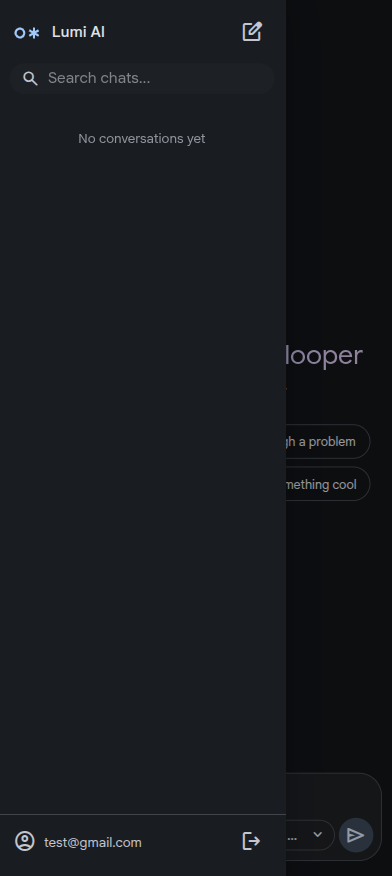
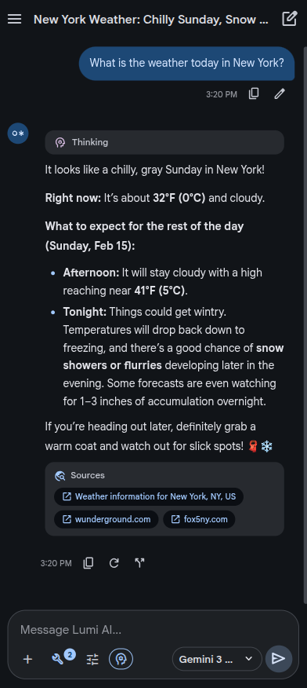
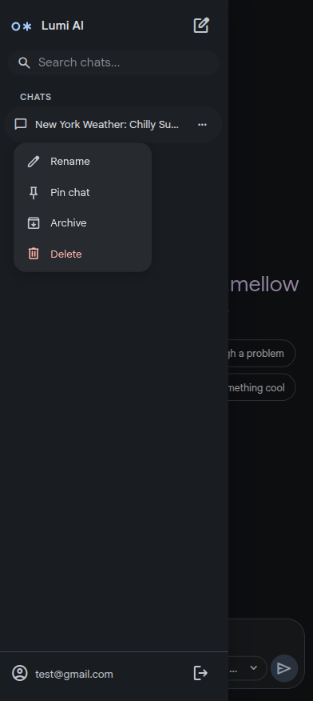
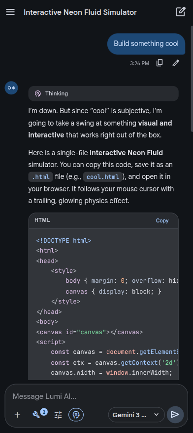

# Lumi AI ✨

A friendly, human-like AI chatbot powered by Google's Gemini models via the Antigravity API.

## Features 🌟

- **Gemini models** - Gemini 2.5 Flash, 2.5 Pro, 3 Flash Preview, and 3 Pro Preview
- **Thinking** - Configurable thinking levels and budgets per model
- **Branching** - Edit messages and navigate between response branches
- **Custom instructions** - Create, toggle, and stack custom instructions to personalize AI behavior
- **File attachments** - Images, PDFs, and other files as context
- **Google Search** - Grounded responses with web search integration
- **Markdown rendering** - Code highlighting, LaTeX, and rich formatting
- **Background streaming** - Responses continue even when switching conversations
- **Local storage** - Conversations stored locally via IndexedDB

## Supported Platforms 📲

| Platform | Format | Download |
|----------|--------|----------|
| Android | APK | [GitHub Releases](https://github.com/iamlooper/Lumi-AI/releases) |
| Windows | EXE, MSI | [GitHub Releases](https://github.com/iamlooper/Lumi-AI/releases) |
| Linux | AppImage, DEB, RPM | [GitHub Releases](https://github.com/iamlooper/Lumi-AI/releases) |

> **Web:** A hosted web version isn't available because OAuth authentication requires a localhost callback, which only works on your own machine. To try Lumi AI in the browser, clone the repo and run `bun run dev` locally.

## Screenshots 📱

[](assets/screenshots/1.webp)
[](assets/screenshots/2.webp)
[](assets/screenshots/3.webp)
[](assets/screenshots/4.webp)
[](assets/screenshots/5.webp)

## Requirements 📋

- [Bun](https://bun.sh/) 1.0+
- [Rust](https://www.rust-lang.org/) 1.77+
- [Tauri](https://v2.tauri.app/) v2

## Build 🔨

```bash
# Install dependencies
bun install

# Development
bun run tauri dev

# Production build
bun run tauri build
```

## Credits 👥

- [Waze](https://t.me/XelXen) - Logo Designer
- [NADER](https://t.me/NaderMagdy0) - Tester
- [Emad](https://t.me/emadseed) - Tester
- [SyntaxSpin](https://Syntaxspin) - Tester
- [inulute](https://t.me/inulute) - Tester
- [opencode-antigravity-auth](https://github.com/NoeFabris/opencode-antigravity-auth) - Antigravity API reference (MIT License)
- [CLIProxyAPI](https://github.com/router-for-me/CLIProxyAPI) - Antigravity API reference (MIT License)

## Disclaimer ⚠️

This is an independent open-source project. It is not endorsed by, sponsored by, or affiliated with Google LLC in any capacity. Use of this software may conflict with Google's Terms of Service — accounts may face restrictions or suspension. We recommend against using your primary Google account. This software is provided "as is" without warranties of any kind.

"Antigravity", "Gemini", "Google Cloud", and "Google" are registered trademarks of Google LLC.

## License 📄

MIT License - see [LICENSE](LICENSE)
